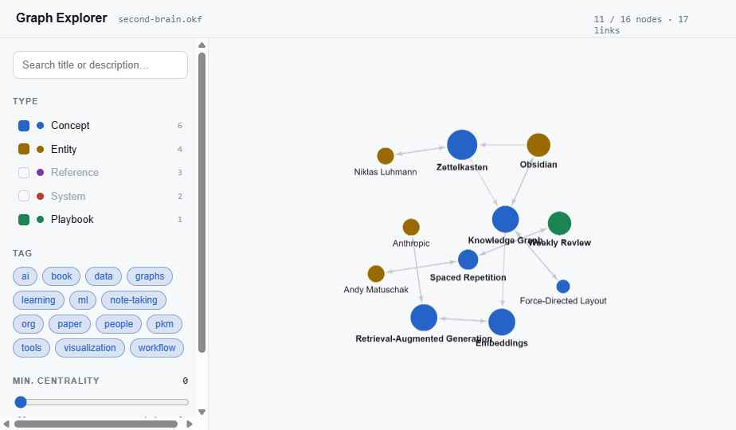

# OKF Skills

Eight skills — plus runnable tooling — for building and using an **OKF (Open Knowledge Format)** "second
brain": a portable, vendor-neutral graph of interlinked markdown files that both humans and AI agents can
read. No database, no runtime, no embeddings.



<sub>The graph explorer from the `okf-dashboard` skill (sample brain). Nodes are coloured by type and
sized by how often they're referenced; references/systems are toggled off by default.</sub>

These skills are **domain-agnostic**: use them to build a gardening brain, an academic/research brain, a
company wiki, or anything else. They're distilled from Google's OKF spec and two reference
implementations (see [Credits](#credits)).

> **What is OKF?** A bundle is just a directory of markdown files. Each file is one node with YAML
> frontmatter and a body that links to other nodes with ordinary markdown links. An agent reads
> `index.md` first, then opens only the few nodes relevant to its task — curated navigation instead of
> vector search. Spec: `GoogleCloudPlatform/knowledge-catalog/okf/SPEC.md`.

## The skills (a full lifecycle)

| Stage | Skill | What it does |
| :-- | :-- | :-- |
| **Scaffold** | `okf-create-bundle` | Create the folder structure + `index.md`/`log.md`, the build process, and the compounding maintenance loop. |
| **Author** | `okf-concept-node` | Write a concept node: frontmatter, a maximum-detail self-contained body, `# Related`, and citations. |
| | `okf-node-types` | Write the non-concept nodes: **entity**, **reference** (the one-per-source provenance layer), and **system**. |
| | `okf-write-playbook` | Write a playbook: a reproducible, step-by-step procedure node. |
| **Cite** | `okf-bibliography` | *Academic brains:* manage the references registry (`references.json`) — verified **primary** citations, no fabrication. |
| **Use** | `okf-dashboard` | Build a graph explorer (see the brain) + an ask-the-brain grounded Q&A (query it). |
| **Grow** | `okf-ingest-source` | Add a new PDF/URL safely: assess → **human approves** → enrich (new node vs. enrich existing). |
| **Maintain** | `okf-gap-scan` | Find what's incomplete (missing/thin sections, coverage gaps, source-comparison gaps, or unanswered searcher questions) → a ranked enrichment backlog. |

The skills cross-reference each other, so an agent chains them naturally (scaffold → author → use → grow
→ maintain).

## Live dashboard demo

The [`demo/`](demo/) folder has six **self-contained** HTML screens showing what the `okf-dashboard`
skill produces (built over a small neutral sample brain — personal note-taking / PKM). Open any file in a
browser: no build step, no server, no external requests.

| Screen | File | Shows |
| :-- | :-- | :-- |
| Graph explorer | [`graph-explorer.html`](demo/graph-explorer.html) | Force-directed graph — search, filter by type/tag/centrality, click a node to open it. |
| Node reader | [`node-reader.html`](demo/node-reader.html) | A node's body + metadata: links out/in, citations, provenance, verification. |
| Ask the brain | [`ask-the-brain.html`](demo/ask-the-brain.html) | Grounded Q&A — every answer cites its source nodes and admits when the brain has no node. |
| Review proposed changes | [`review-proposed-changes.html`](demo/review-proposed-changes.html) | The ingest loop: enrich / new-node / contradiction cards, approved one-by-one before anything is written. |
| Gap dashboard | [`gap-dashboard.html`](demo/gap-dashboard.html) | The enrichment backlog: nodes ranked by missing/thin sections, plus missing-node candidates. |
| Missing nodes | [`missing-nodes.html`](demo/missing-nodes.html) | Missing-node candidates as their own screen: topics your nodes name but have no node for, with suggested type + create-node. |

## Tools (runnable reference implementations)

The [`tools/`](tools/) folder has domain-agnostic Python (stdlib only) that *runs* what the skills
describe — drop it into `<your-bundle>/tools/`:

- **`okf_tools.py`** — `index` / `graph` / `lint` (backs `okf-create-bundle` + `okf-dashboard`).
- **`gap_scan.py`** — scores every node's sections and writes `gaps.json` + a self-contained
  `gap-dashboard.html` (backs `okf-gap-scan`); `SCHEMA` is an editable config at the top.

See [`tools/README.md`](tools/README.md). They're references to adapt, not a framework.

## Install

### Claude ecosystem (Claude Code) — one-click, auto-triggering

```
/plugin marketplace add saulmcphd/okf-skills
/plugin install okf-skills@okf-skills
```

Once installed, the right skill triggers automatically — e.g. *"help me start a gardening second brain"*
surfaces `okf-create-bundle`; *"add a concept node for composting"* surfaces `okf-concept-node`. Agent
Skills also work in the Claude apps and the Claude Agent SDK.

### Using with other agents (Gemini, ChatGPT / Codex, etc.)

The auto-triggering plugin mechanism is Claude-specific, **but the skills are just markdown instruction
files**, so any agent can use their content:

- **Point your agent at this repo** and ask it to follow the relevant `skills/*/SKILL.md`.
- **Or paste** the `SKILL.md` you need into the conversation / add it as a context or knowledge file
  (e.g. a Gemini `GEMINI.md`, a Codex `AGENTS.md`, or a custom-GPT knowledge file).

The **OKF bundles you build are fully model-neutral** — that's the whole point of the format. Only the
convenience of automatic triggering is Claude-specific.

## Repository layout

```
okf-skills/
├── .claude-plugin/
│   └── marketplace.json          # makes the repo installable as a marketplace
├── plugins/
│   └── okf-skills/
│       ├── .claude-plugin/
│       │   └── plugin.json        # the plugin manifest
│       └── skills/
│           ├── okf-create-bundle/SKILL.md
│           ├── okf-concept-node/SKILL.md
│           ├── okf-node-types/SKILL.md
│           ├── okf-bibliography/SKILL.md
│           ├── okf-write-playbook/SKILL.md
│           ├── okf-dashboard/SKILL.md
│           ├── okf-ingest-source/SKILL.md
│           └── okf-gap-scan/SKILL.md
├── demo/                          # six self-contained dashboard screens (open in a browser)
├── tools/                         # runnable reference implementations (okf_tools.py, gap_scan.py)
├── screenshots/                   # images used in this README
├── README.md
└── LICENSE
```

## Credits

Distilled from **Google's OKF specification** (`GoogleCloudPlatform/knowledge-catalog/okf/SPEC.md`), and
enriched with two reference implementations: **Andrej Karpathy's "LLM wiki" pattern** (the compounding,
agent-maintained knowledge base) and **Marie Haynes' OKF brain** ([mariehaynes.com/okf](https://www.mariehaynes.com/okf/)).
Conceptual ancestor: the LLM-wiki idea of a knowledge base an agent reads by navigation, not retrieval.

## License

MIT © Saul McLeod — see [LICENSE](LICENSE).
